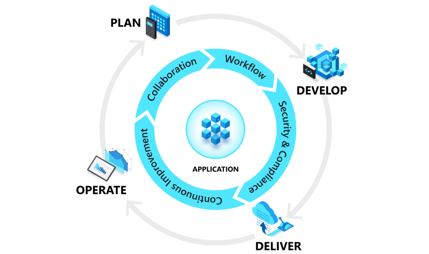
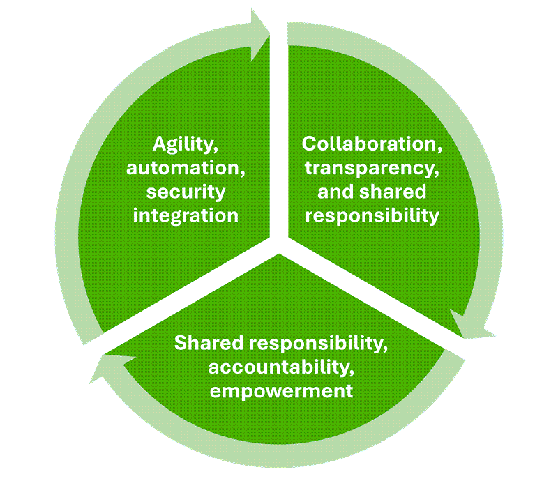
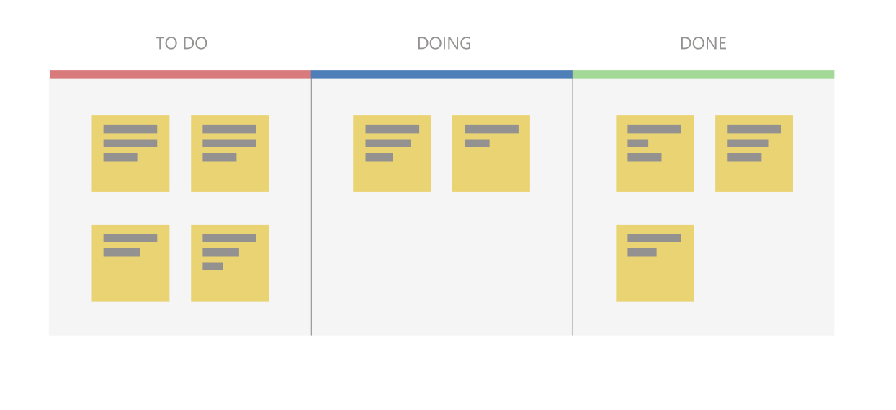
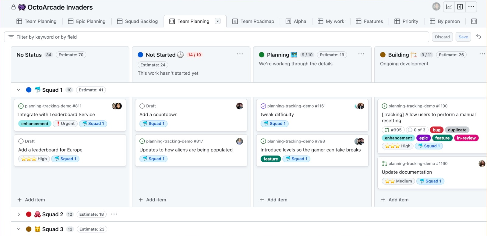
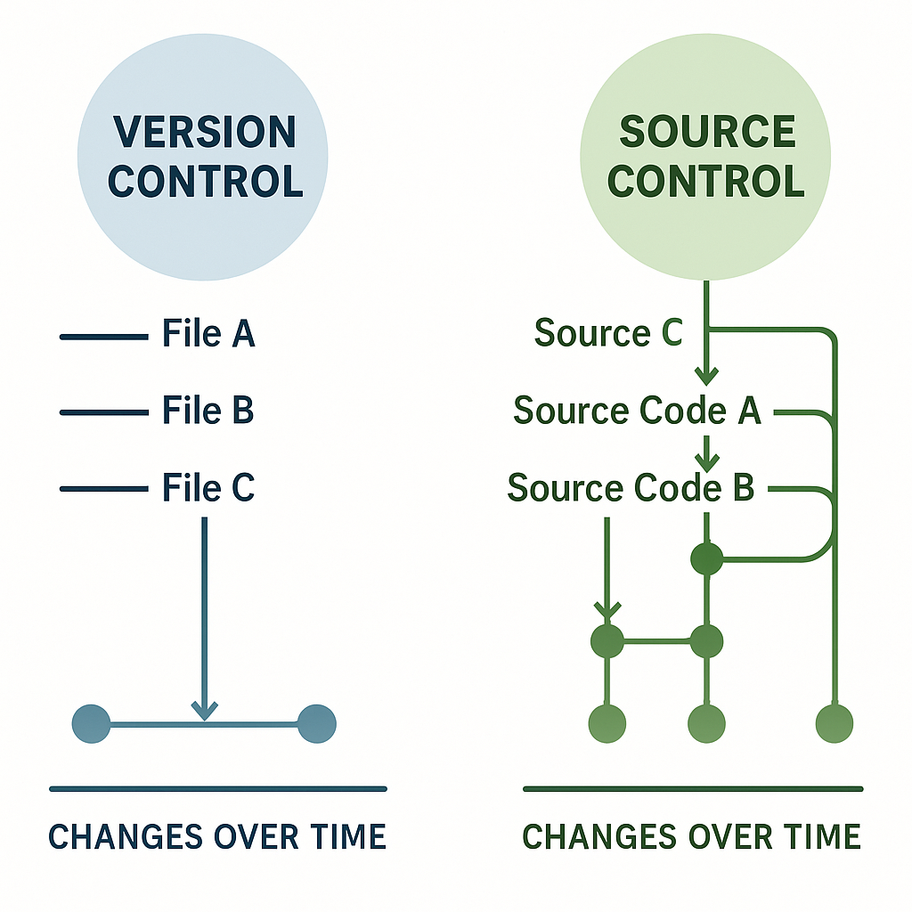
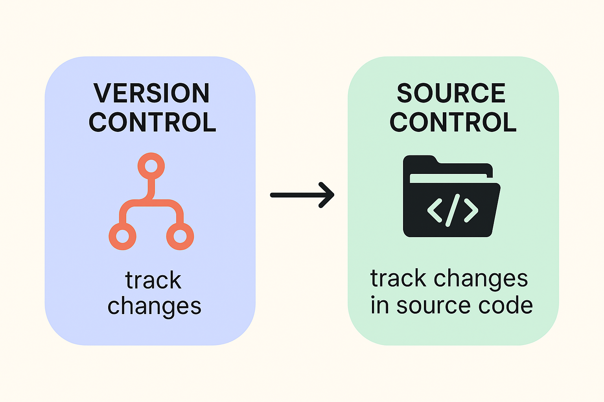
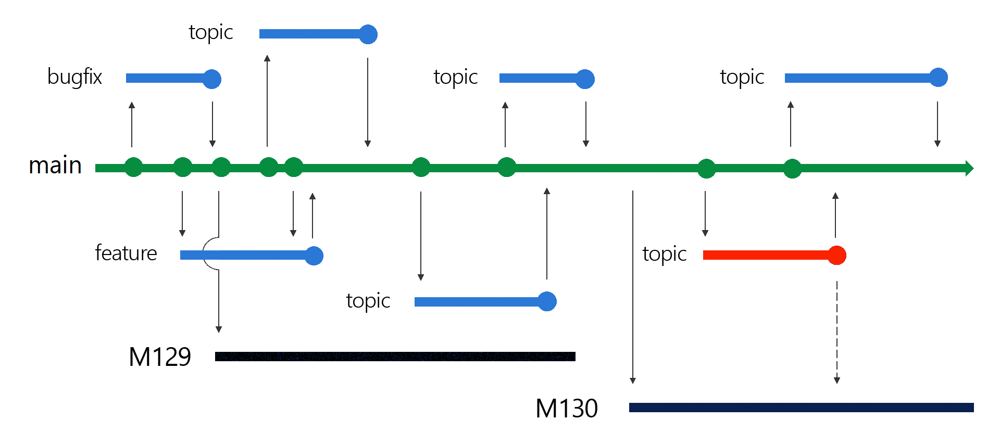
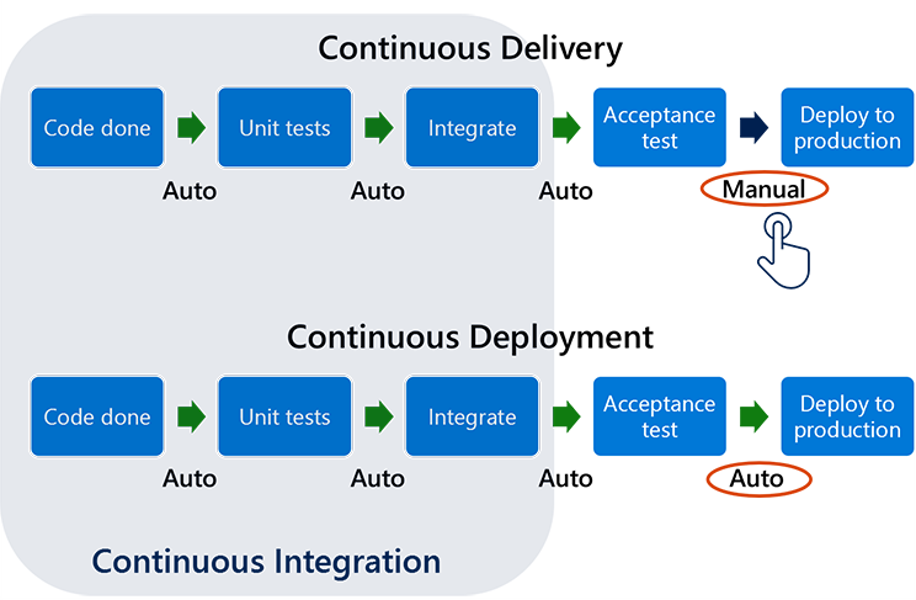

# DevOps
Learn all about DevOps

<!-- Title: -->
<h1><a href="https://github.com/skthati/skthati.git">All About DevOps</a> - DevOps </h1>

<!-- Table of contents -->

<ol>
    <li><a href="#basics">Basics</a> </li>
</ol>

<!-- Basics -->
## Basics 

    DevOps combines development (Dev) and operations (Ops) to unite people, process, and technology in application planning, development, delivery, and operations

.

    Optimized software delivery. Improve collaboration between Development team and Operations Team.

.

    Uniting people, process and technology.

.

    - Team collaborations
    - Continuous learning
    - Agile mindset

.

### Traditional application cycle

    - Conflicting goals in internal IT operations.

(<a href="#readme-top">back to top</a>)

### Boiled down to

- Culture
- Automation - 
- Measurement
- Sharing

Automation makes process scalable, repeatable and more resilient by minimizing human errors

### DevOps Fundamental Practices

- Version control, 
- Continuous integration, 
- Continuous testing, 
- Continuous delivery, 
- Continuous monitoring, 
- Continuous security, and 
- Infrastructure as Code, and how 
    
### GitHub Projects

- GitHub Projects can facilitate the planning of your projects.

### Joke

- No body knows everything but everyone thinks they are doing it right way.
.

- Culture of owning. eliminate bottle necks, Increase job satisfaction.

## DevOps Culture

- Encompasses humans and organizational factors that impact development and delivery. 
- DevOps culture in an organization is by promoting collaboration, transparency, shared responsibility, and continuous learning

- Build Mutual Respect and blameless culture.
- Teams should have clear roles and responsibilities. (Final decisions should be evidence based)
- Continuous learning and improvements. Teams should be specialized in their functions
- Optimization. Teams should commit to regular reviews of their standard operating procedures.
- Safe experimentation.

    

- Collaboration
- Transparency
- Shared responsibility
- Continuous learning
- Measurable outcome
- Customer Centric focus
- Agility
- Automation
- Security Integration

# What is Agile?

- Using DevOps practices, handling software development and project management.
- Ability to rapidly respond to customer needs and feedback.
- Faster, reliable and more customer-centric software delivery.

### Agile Principles and Values

- Team Interactions 
- Working Software
- Customer collaboration
- Responding to changes

### Agile Methods and Practices

- Agile principles sets guidelines to achieve flexible and easily adaptable needs and preferences.
- Framework adaption to achieve all phases of DevOps Life Cycle. (Planning, Development, Delivery, Operations)
- Frameworks (Scrum, Kanban)

### Scrum

- Scrum is a framework used to manage work and backlogs using small iterations.
- Iterations also called Sprints.
- To achieve collaboration and progress, Sprint are categorized in Events, Artifacts and roles 

#### Events

- Also known as ceremonies
- Daily scrum is typically 15 minutes. Daily Stand-ups, 

#### Artifacts

- prioritizing list of features, enhancements and bugs to develop.
- They include Product backlog, sprint backlogs also
- Task Board - Visual way to track the progress. It shows backlog items divided into tasks required to complete.
- Tasks have labels like ( ToDo, InProgress, Done)
- Sprint BurnDown Chart - Visual way to track the remaining work, typically showed in hours.
#### Roles

- Product Owner: Responsible for defining, maintaining and prioritizing product
- Scrum Master: Responsible for scrum progress and scrum process is adhered
- Scrum Team: Responsible for building the product.

    

    Sprint retrospective is part of continuous learning. It serves as the opportunity to review the most recently completed sprint, identify areas for improvement, 

## Kanban

- visualize project related work in billboards form.

    

## Difference between Scrum and Kanban

- Scrum uses fixed-length sprints. Kanban continuous flow model depending on availability of resources.
- Roles and Ceremonies: Scrum has clearly defined roles and ceremonies. Kanban is adaptable according to their needs.
- Work Planning: Scrum uses prioritized backlog. Kanban uses dynamic backlog
- Visualizations: Scrum uses sprint boards and sprint burnDown charts. Kanban uses kanban boards.

## Version Control

- Managing updates to the code by storing in repositories.
- Repository cloning: 
- Pull Requests:
- conflict resolution:
- rollback

## Continuous Integration

- Automate process of merging code changes, testing them.
- Detect any potential issues in development phase
- Automated tests validate code change issues or regression issues.

## Continuous Deployment

- Built artifacts are deployed and made available to customer asap.
- Handles environment changes, testing, staging and productions using automation

## Continuous Monitoring

- Realtime visibility of health and performance of entire application stack

## Continuous Security ( DevSecOps )

- focuses on security practices at each stage. ( Planning, Coding, Testing, Deployment and Operations)

# GitHub Projects

- GitHub Projects creates an ability to organize, track and manage work in a collaborative and visual manner.
- Helps manage software development lifecycle.
- Helps plan, track progress and coordinate tasks within a repository.
- Supports milestones, timelines for projects, and track progress

## GitHub Projects Board

- Visual representation of corresponding projects.
- Supports Kanban boards
- Consists of columns and cards that allows to organize and track issues and pull requests
- Columns to customize different project stages
- Cards for work items (issues, pull requests). Each card can have many fields ( labels, assignee, due dates, descriptions)

    

# Source control and Version control

- version control includes change management of any file type.
- Version control keeps track of changes to files within its scope of management.
- Roll back and recovery - If there is an error, we can recover working version of file.
- Branching and Merging - Multiple developers can work on same codebase.
- Automation 

    

    

    

## Version control

    - History and version tracking 

## Primary goals and benefits of DevOps

- Accelerate time to market
- Agile process to quickly adapt to market
- Stability and reliability
- Quicker detection and resolution of issues.

## IaC - Infrastructure as Code

 - Managing and provisioning computing, networking and storage infrastructure via code.

## DevOps Application Cycle

- Planning --> this phase include agility, customer-centric focus, alignment, and visibility
- Development --> include programming, testing, and code reviews
- Delivery --> deploying the artifacts built during the development stage into production environments in a consistent and reliable manner
- Operations --> maintaining, monitoring, and troubleshooting applications in production environments.

## Plan with DevOps

- collaboration, shared responsibility, continuous learning, and optimization through version control, continuous integration and continuous testing, and Infrastructure as Code.

# Continuous Integration
- Process of building and testing updated versions continuously before reviewing and merging to main branch.

    

- Shift-left Strategy
- Longer it takes to detect a defect in code change the expensive it becomes to fix it.

# Shift-left Testing
- Testing maximizes code quality and minimizes operational risk.

### Shift-left
- Process of testing the code as early as in development phase to maximize stability and reliability of the product.

## Testing Types

### Unit Testing
- Smallest testable part of an application.
- Should be included in as early as in development phase.

### Functional Testing
- Testing the entire application works according to specified requirements.

### Smoke Testing
- Testing the critical functionalities of the applications are working before doing further tests.

### Integration Testing
- Testing the interaction between the application components.
- Recommendation is to schedule them at regular intervals.

### Acceptance Testing
- Testing whether the product meets the business requirement and ready to deliver to customer.
- Acceptance criteria and User stories are important part of acceptance testing.

# Continuous Delivery
- Process of making product available to customer using continuously deploying latest version of the application to production environment.

#### Time to Deploy and Time to Mitigate (TTM) Also known as Time to remediate (TTR)

## Benefits of Continuous Delivery
- Accelerated release cycle
- Increased resiliency - Rapid feedback cycles, automated deployment, minimize human errors, simplify rollback process.
- Improved collaboration - build, test and delivery.
- Efficient Resource utilization - minimize time spent on manual, repetitive, and time consuming tasks.

## Best practices for Agile 

https://learn.microsoft.com/en-us/azure/devops/boards/best-practices-agile-project-management?view=azure-devops&tabs=agile-process

# Complete this certification

https://learn.microsoft.com/en-us/training/modules/plan-agile-github-projects-azure-boards/

https://learn.microsoft.com/en-in/training/paths/az-400-work-git-for-enterprise-devops/

https://learn.microsoft.com/en-us/training/courses/az-400t00

https://learn.microsoft.com/en-us/devops/what-is-devops

Markdown language
https://github.com/skills/communicate-using-markdown

Software Testing

https://github.com/elenastef/proj01/blob/master/Foundations%20of%20software%20testing%20-%20ISTQB%20Certification%20book.pdf

https://www.utcluj.ro/media/page_document/78/Foundations%20of%20software%20testing%20-%20ISTQB%20Certification.pdf

https://www.istqb.org/wp-content/uploads/2024/11/ISTQB_CTFL_Syllabus_v4.0.1.pdf

