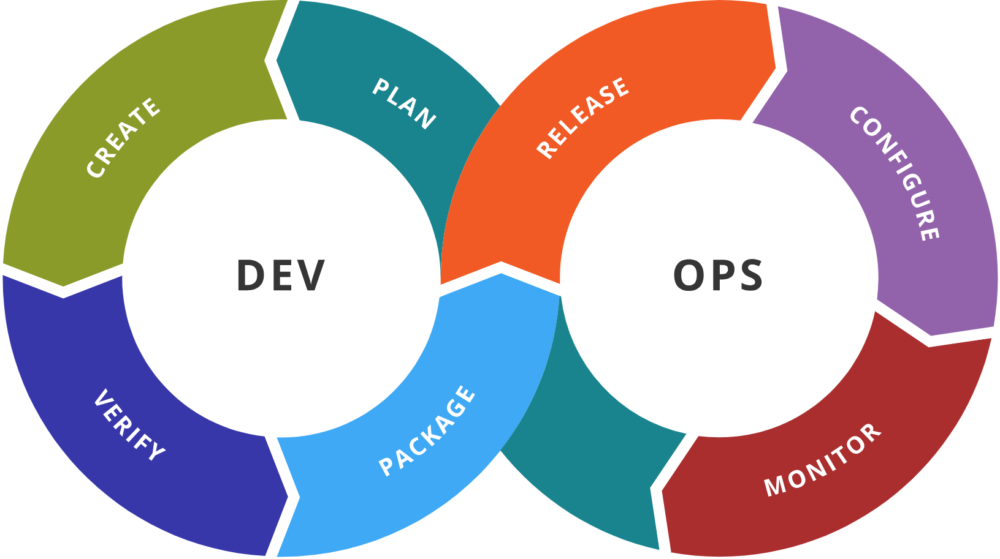

# Devops
Learn all about Devops

<!-- Title: -->
<h1><a href="https://github.com/skthati/skthati.git">All About Devops</a> - Devops </h1>

<!-- Table of contents -->

<ol>
    <li><a href="#basics">Basics</a> </li>
</ol>

<!-- Basics -->
## Basics 

    DevOps combines development (Dev) and operations (Ops) to unite people, process, and technology in application planning, development, delivery, and operations

.

    Optimized software delivery. Improve collaboration between Development team and Operations Team.

.

    Uniting people, process and technology.

.

    - Team collaborations
    - Continuous learning
    - Agile mindset

.

### Traditional application cycle

    - Conflicting goals in internal IT operations.

(<a href="#readme-top">back to top</a>)

### Boiled down to

    - Culture
    - Automation - 
    - Measurement
    - Sharing

    Automation makes process scalable, repeatable and more resilient by minimizing human errors

### Joke

    No body knows everything but everyone thinks they are doing it right way.
.

     Culture of owning. eliminate bottle necks, Increase job satisfaction.

## Devops Culture

    - Encompasses humans and organizational factors that impact development and delivery. 

.

.

    - Collaboration
    - Transparency
    - Shared responsibility
    - Continuous learning
    - Measurable outcome
    - Customer Centric focus
    - Agility
    - Automation
    - Security Integration

## Primary goals and benefits of Devops

    - Accelerate time to market
    - Agile process to quickly adapt to market
    - Stability and reliability
    - Quicker detection and resolution of issues.

## IaC - Infrastructure as Code

    - Managing and provisioning computing, networking and storage infrastructure via code.

## Best practices for Agile 

https://learn.microsoft.com/en-us/azure/devops/boards/best-practices-agile-project-management?view=azure-devops&tabs=agile-process

# Complete this certification

https://learn.microsoft.com/en-us/training/modules/plan-agile-github-projects-azure-boards/

https://learn.microsoft.com/en-in/training/paths/az-400-work-git-for-enterprise-devops/

https://learn.microsoft.com/en-us/training/courses/az-400t00